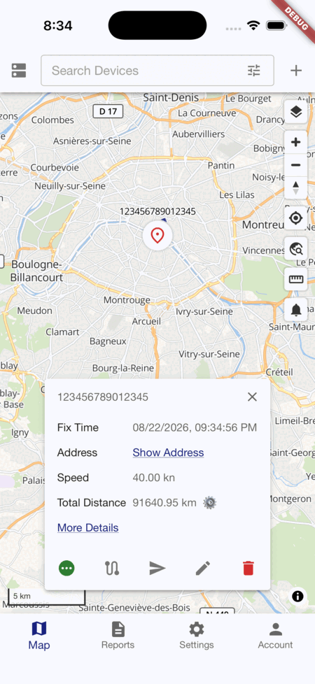

# [Traccar Manager app](https://www.traccar.org/manager)

[](https://play.google.com/store/apps/details?id=org.traccar.manager) [](https://itunes.apple.com/app/traccar-manager/id1113966562)

## Overview

Traccar Manager is the official mobile app for managing and monitoring your GPS tracking devices with [Traccar](https://github.com/traccar/traccar), the open-source GPS tracking platform.

- **Live Tracking**: View the real-time location of all your devices on an interactive map.
- **Device Management**: Add, edit, or remove devices directly from your mobile device.
- **Event Notifications**: Receive alerts for geofence crossings, device status changes, and more.
- **History and Reports**: Review past routes and generate trip history for any device.
- **Secure and Private**: All your data stays on your own server—no third-party access.

Connect the app to your Traccar Server, log in with your credentials, and instantly manage and monitor your fleet or personal devices from anywhere.

Don't have a Traccar server yet? [Try the live demo](https://www.traccar.org/demo-server/) or see the [installation guides](https://www.traccar.org/install-vps/) to set up your own for free.

| Manager App |
|---|
|  |

## Build

Standard Flutter project:

```shell
flutter pub get
flutter run
```

## Team

- Anton Tananaev ([anton@traccar.org](mailto:anton@traccar.org))

## License

Apache License, Version 2.0. See [LICENSE.txt](https://github.com/traccar/traccar-manager/blob/master/LICENSE.txt) for details.
